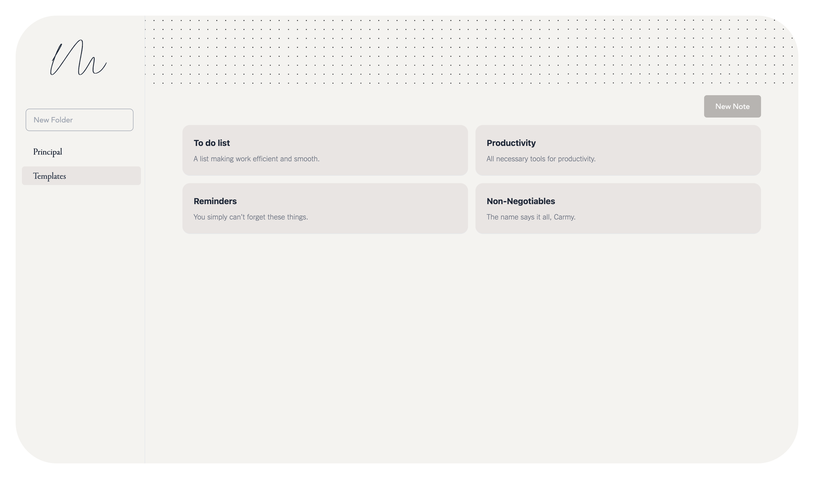
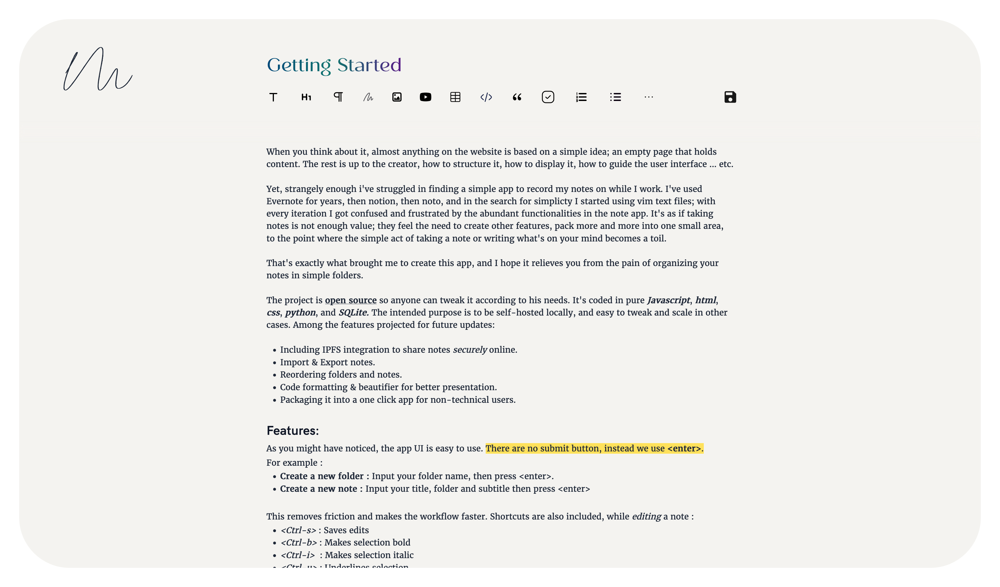

# Memory

Memory is a simple, open-source note-taking application designed for minimalism and efficiency. The goal is to provide a straightforward interface for taking and organizing notes without unnecessary features that complicate the experience.





## Why Memory?

When you think about it, almost anything on the web starts with a simple idea: an empty page that holds content. Yet, finding a simple, frictionless note-taking app has been a challenge. Over time, many apps have become bloated with features, making the act of writing down thoughts unnecessarily complex.

Memory was created to solve this problem. It offers a lightweight and intuitive way to organize notes in simple folders, making it easy to record ideas while you work.

## Features

- Simple UI with no unnecessary buttons—just press `<enter>` to submit.
- Folder and note creation using `<enter>`:
  - **New Folder**: Input the folder name and press `<enter>`.
  - **New Note**: Input the title, folder, and subtitle, then press `<enter>`.
- Built-in keyboard shortcuts for a faster workflow:
  - `<Ctrl-s>`: Save edits.
  - `<Ctrl-b>`: Bold selection.
  - `<Ctrl-i>`: Italicize selection.
  - `<Ctrl-u>`: Underline selection.
  - `<Ctrl-h>`: Highlight selection.
- Instant formatting for pasted URLs (YouTube, images, etc.).
- Local media storage under `/notes`.

### Future Features

- IPFS integration for secure note sharing.
- Import & Export notes.
- Folder and note reordering.
- Code formatting & beautification.
- One-click installation package for non-technical users.

## Installation

To install and run Memory, ensure you have Python installed on your system.

1. Clone the repository:

   ```sh
   git clone https://github.com/yousboot/memory.git
   cd memory
   ```

2. Install dependencies:

   ```sh
   pip install -r requirements.txt
   ```

3. Run the application:
   ```sh
   python app.py
   ```

The app will start running locally, allowing you to access it via your browser.

## Contributing

Memory is open-source, and contributions are welcome. If you have ideas or improvements, feel free to submit a pull request.

## Connect

For feedback or contributions, reach out to me:

- [LinkedIn](https://www.linkedin.com/in/yousbot/)
- [GitHub](https://github.com/yousboot)

Made with ❤️ by Youssef.
